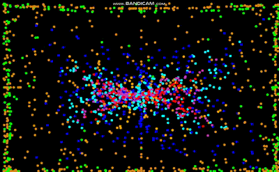

# BotsOfBoria
Particle simulation (n-body simulation), all 'bots' or particles follow specific rules based on attraction and repulsion based on color, this creates interesting emergent behavior.

Press r to update environment.

Including both python and java versions. 

